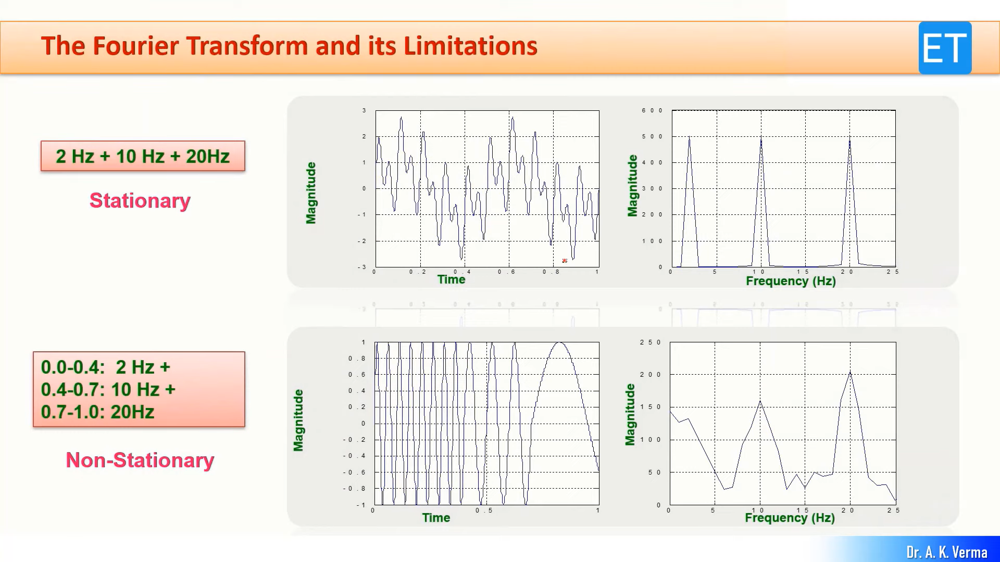
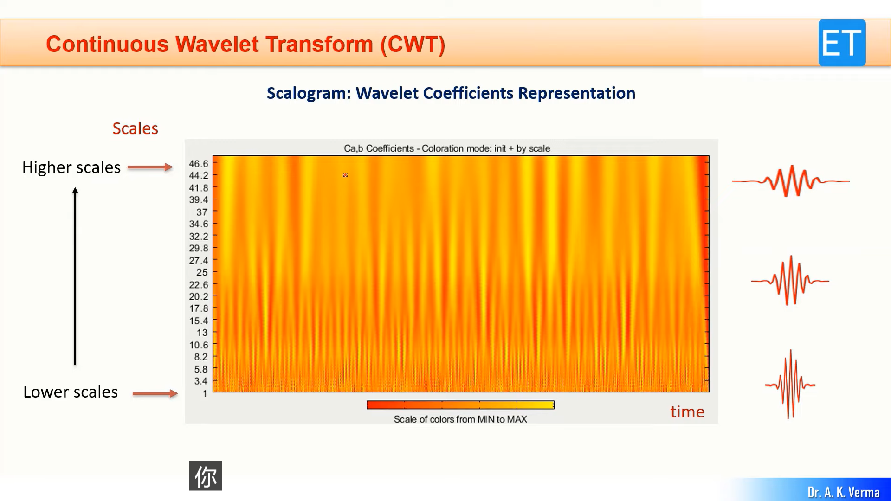
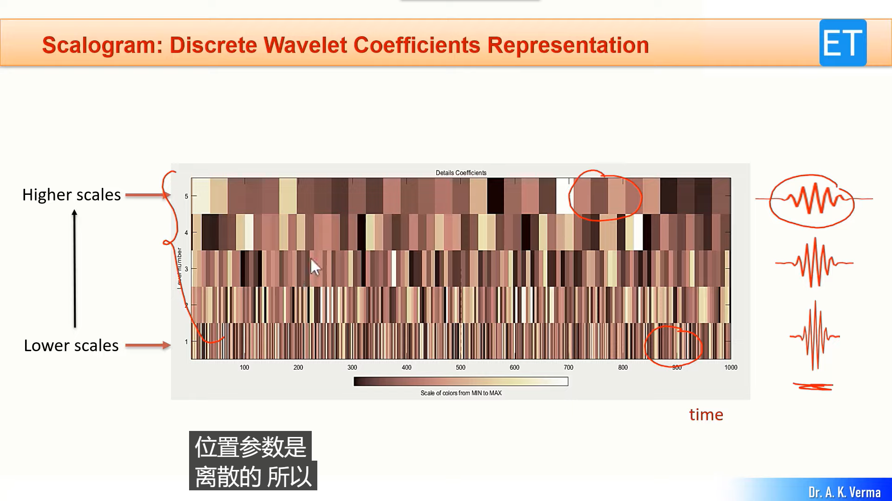
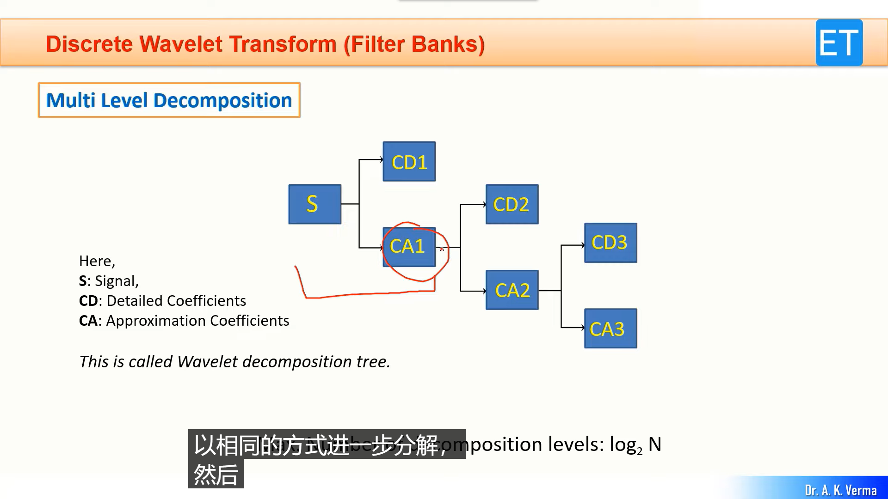
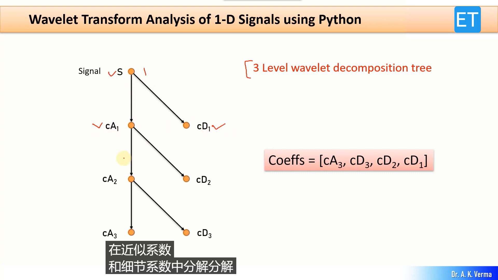

# DWT

## 视频教程

* https://www.youtube.com/watch?v=imX0DJn_-wY
* https://www.youtube.com/watch?v=5LZtl31Pl9E
* https://www.youtube.com/watch?v=4W1NzQkfp9Y

## 笔记

傅里叶变换的优势是 Stationary Signals，劣势就是 Non-stationary Signals。

如果在信号的任何时间都有任何 N 个频率的信号叠加，那么使用傅里叶变换是正确的。

但是如果在信号的 t1 区间有频率 f1，在 t2 区间有频率 f2，这样叠加起来，傅里叶变换将不能很好表现。




解决方法是 STFT(Short-Time Fourier Transform)，设置一个窗口，得到一个对于时间 t 的（表示窗口在 t 附近）频域图，但缺点是窗口大小不能改变，也会产生分辨率困境。

小波变换的主要成分是不同频率的小波，有不同的类型，比如 `baar` 等等。







cA 和 cD 在多级分解的关系：




## Installation

```bash
pip install PyWavelets​
```

## MATLAB

```matlab
>> waveletAnalyzer
```

## Python examples

For 1-D Signals:
```python
import pywt # PyWavelets

x = [3, 7, 1, 1, -2, 5, 4, 6] # signal
cA, cD = pywt.dwt(x, 'haar')  # wavelet transform
y = pywt.idwt(cA, cD, 'haar') # inverse wavelet transform

print(cA) # approxmation coeffs
print(cD) # detailed coeffs
print(y)  # reconstructed signal
```
