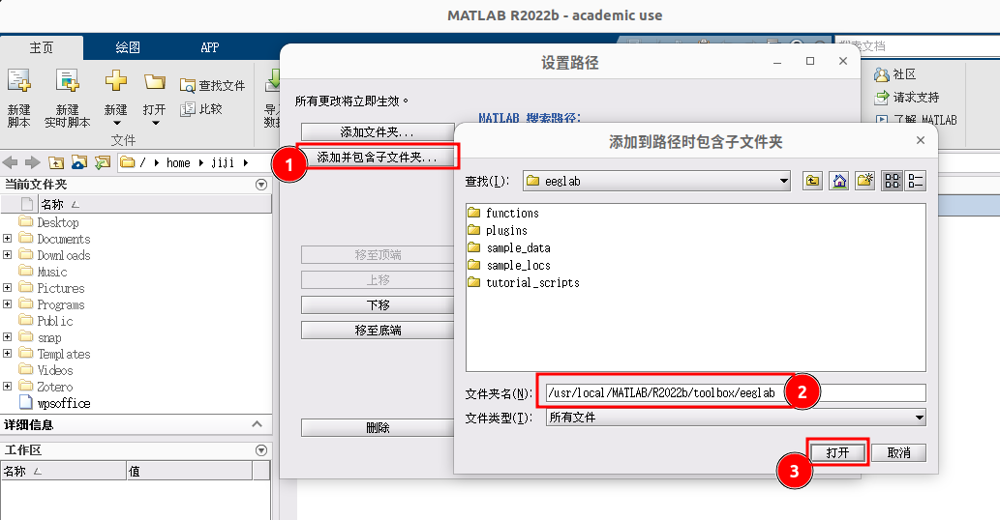
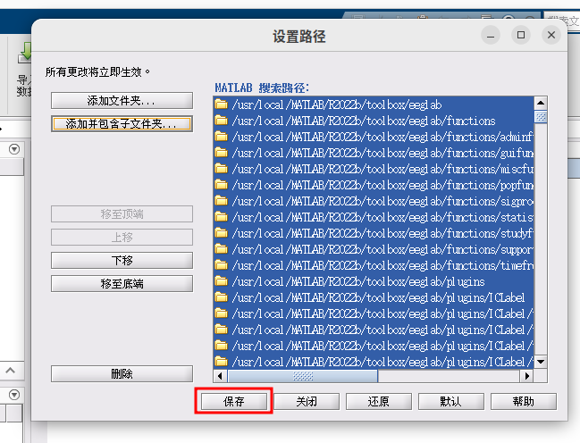
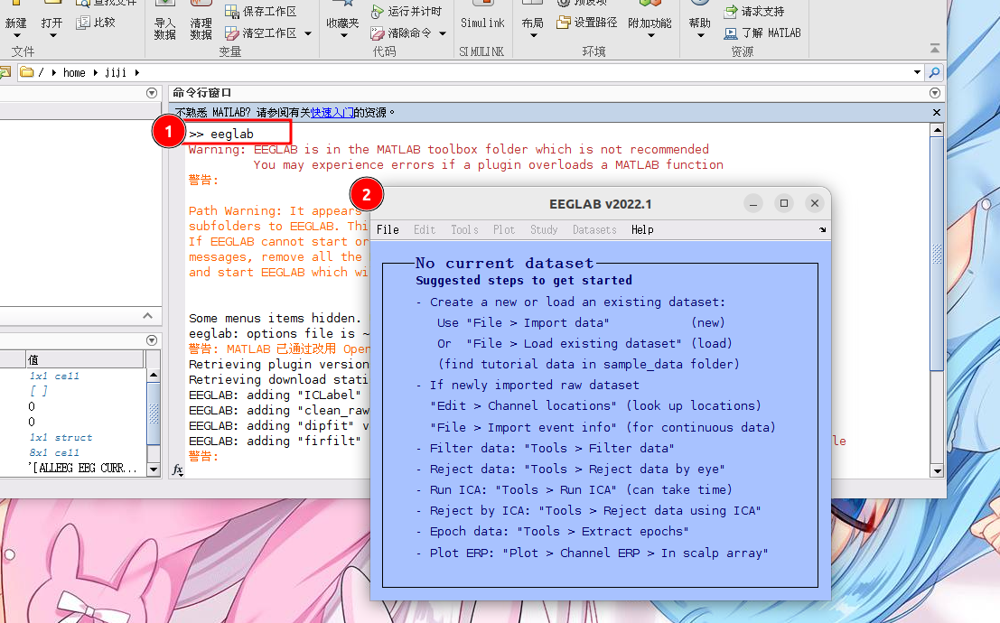

# EEGLAB 的安装

!!!info
    在安装 EEGLAB 前请确保安装了 MATLAB，本文基于 Ubuntu 22.04 和 MATLAB 2022b 的环境撰写。

[EEGLAB](https://sccn.ucsd.edu/eeglab/index.php) | [下载地址(current)](https://sccn.ucsd.edu/eeglab/currentversion/eeglab_current.zip) | [Archive](https://sccn.ucsd.edu/eeglab/download/daily/) | [Revision](https://eeglab.org/others/EEGLAB_revision_history.html)

先下载并解压，再找到 MATLAB 的安装路径，如我的是 `/usr/local/MATLAB/R2022b/toolbox`，则解压后将 `eeglab` 文件夹拷贝进来。

```bash
unzip eeglab_current.zip
sudo mv eeglab2022.1 /usr/local/MATLAB/R2022b/toolbox/eeglab
```
然后点击“设置路径”按钮，一通操作猛如虎：






设置完成之后，只需在 MATLAB 命令行中输入 `eeglab` 即可打开如下界面：



